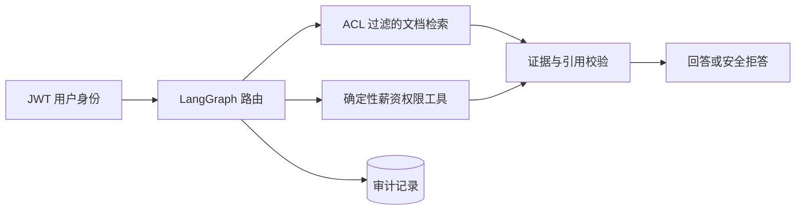

# Demo Internal Knowledge Agent

一个轻量、可运行的内部知识库 Agent Demo。它展示的重点不是聊天框，而是企业场景里真正重要的边界：认证用户、文档 ACL、过滤后检索、受控内部数据工具、来源引用、审计记录和线程隔离。

技术栈：FastAPI、LangChain、LangGraph、PostgreSQL/pgvector、React、TypeScript、Docker Compose。

## 能力

- PDF、DOCX、Markdown、TXT 文档 ingest，保留页码或章节信息。
- 文档权限支持全员、用户、角色和部门；ACL 在向量排序前进入 SQL 查询。
- 程序员只能查询自己的薪资；`hr` 与 `admin` 可以调用受控薪资接口查询其他用户。
- 无授权证据、低相关度证据或异常引用统一安全拒答。
- 回答返回文档标题、页码/章节和原文片段，工具与权限事件写入审计表。
- JWT 登录、用户所属线程隔离、管理员上传与失败重试界面。

## 快速启动

1. 创建本地配置：

   ```bash
   cp .env.example .env
   ```

2. 修改 `.env`，至少填写：

   ```dotenv
   JWT_SECRET=请替换为足够长的随机字符串
   OPENAI_API_KEY=你的_API_Key
   ```

3. 启动：

   ```bash
   docker compose up --build
   ```

4. 打开 [http://localhost:3000](http://localhost:3000)。后端 OpenAPI 位于 [http://localhost:8000/docs](http://localhost:8000/docs)。

如果端口已被占用，可以在 `.env` 设置 `FRONTEND_PORT=13000` 和 `BACKEND_PORT=18000`。

启动过程中 backend 会自动执行 Alembic migration 和幂等 seed；ingest worker 会随后处理三份示例文档。

## 演示账号

所有账号的演示密码都是 `demo-password`。

| 用户名 | 部门 / 角色 | 预期权限 |
|---|---|---|
| `alice.programmer` | engineering / programmer | 全员文档、工程文档、本人薪资 |
| `helen.hr` | people / hr | 全员文档、HR 薪酬制度、所有用户薪资 |
| `andy.admin` | operations / admin | 所有文档、所有用户薪资、文档管理 |

建议验收问题：

- Alice：`工程发布流程是什么？`
- Alice：`我的薪资是多少？`
- Alice：`helen.hr 的薪资是多少？`（应安全拒答）
- Helen：`alice.programmer 的薪资是多少？`

## 安全设计



- FastAPI 从 JWT 加载可信用户，前端不能传入角色或部门覆盖身份。
- SQL 先执行 ACL `WHERE`，再进行 pgvector cosine distance 排序和 `LIMIT`。
- 被拒绝的薪资查询不会读取薪资行，也不会把金额交给模型。
- 文档内容被标记为不可信证据，不能覆盖系统指令。
- `thread_id` 有独立所有者；访问其他用户线程返回 404。
- Demo 凭据和默认数据库密码仅用于本地演示，不能直接用于生产。

## 本地验证

后端：

```bash
cd backend
uv sync --extra dev
.venv/bin/python -m pytest -q
```

前端（公司网络）：

```bash
cd frontend
pnpm install --registry=https://nexus-xmn02.int.rclabenv.com/nexus/content/groups/npm-all/
pnpm test -- --run
pnpm run build
```

Compose 配置检查：

```bash
docker compose config --quiet
```

## 镜像与公司网络

Dockerfile 和 Compose 的公共基础镜像默认通过 `docker.m.daocloud.io` 拉取，避免直接访问 Docker Hub。前端容器构建默认使用公司 Nexus npm group；也可以在构建时传入其他 `NPM_REGISTRY`。

本地 Demo 只需要拉取基础镜像并在本机 build，不需要向 Docker Hub 或 Harbor 发布应用镜像。

## 设计资料

- [产品与工程设计蓝图](docs/design.html)
- [实现计划](docs/superpowers/plans/2026-07-11-internal-knowledge-agent-demo.md)
