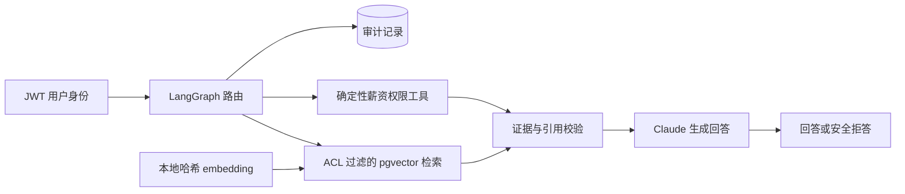

# Demo Internal Knowledge Agent

一个轻量、可运行的内部知识库 Agent Demo。它展示的重点不是聊天框，而是企业场景里真正重要的边界：认证用户、文档 ACL、过滤后检索、受控内部数据工具、来源引用、审计记录和线程隔离。

技术栈：Claude、FastAPI、LangChain、LangGraph、PostgreSQL/pgvector、React、TypeScript、Docker Compose。

## 能力

- PDF、DOCX、Markdown、TXT 文档 ingest，保留页码或章节信息。
- Claude 负责生成最终答案；本地哈希 embedding 负责生成 pgvector 文档与查询向量，不依赖其他模型供应商。
- 文档权限支持全员、用户、角色和部门；ACL 在向量排序前进入 SQL 查询。
- 程序员只能查询自己的薪资；`hr` 与 `admin` 可以调用受控薪资接口查询其他用户。
- 无授权证据、低相关度证据或异常引用统一安全拒答。
- 回答返回文档标题、页码/章节和原文片段，工具与权限事件写入审计表。
- JWT 登录、用户所属线程隔离、管理员上传、失败重试与提取内容预览界面。

## 快速启动

这个项目使用 Docker Compose 管理四项服务：前端、后端、文档 Ingest Worker 和 PostgreSQL。Docker Compose 会读取项目根目录的 `docker-compose.yml`，因此不需要分别启动每一项服务。

下面的命令都需要在项目根目录执行，并确保 Docker Desktop 已经启动。

### 1. 创建本地配置

复制配置模板：

```bash
cp .env.example .env
```

打开新生成的 `.env`，至少填写：

```dotenv
JWT_SECRET=请替换为足够长的随机字符串
ANTHROPIC_API_KEY=你的_Anthropic_API_Key
```

`.env` 只用于本机，并已被 Git 忽略，不会提交到仓库。

### 2. 第一次启动全部服务

```bash
docker compose up -d --build
```

这一条命令会构建项目镜像并启动全部四项服务：

- `--build`：启动前构建最新的前端和后端镜像。
- `-d`：让服务在后台运行，执行后可以继续使用当前终端。

以后如果代码和依赖没有变化，可以直接使用 `docker compose start` 恢复已经停止的服务。

### 3. 检查是否启动成功

```bash
docker compose ps
```

看到 `frontend`、`backend`、`ingest` 和 `postgres` 均处于运行状态，即表示服务已经启动。首次启动可能需要等待十几秒。

### 4. 打开 Demo

- 前端：[http://localhost:3000](http://localhost:3000)
- 后端 OpenAPI：[http://localhost:8000/docs](http://localhost:8000/docs)

如果端口已被占用，可以在 `.env` 设置 `FRONTEND_PORT=13000` 和 `BACKEND_PORT=18000`，然后访问对应的新端口。

启动过程中，backend 会自动更新数据库结构并写入演示数据；ingest worker 会使用本地 embedding 处理 12 份真实感示例文档，并在启动时自动将旧版本地索引升级到当前版本。12 份文档按 ACL 分为 6 份全员文档、3 份 Engineering 文档、2 份 HR/Admin 文档和 1 份 Admin-only 文档。Ingest 不需要 Anthropic Key，只有生成聊天回答时才会调用 Claude。

## 日常 Docker 操作

### 查看日志

```bash
docker compose logs -f
```

这会持续显示所有服务的日志。按 `Ctrl+C` 只会退出日志查看，不会停止服务。

### 停止和再次启动

```bash
docker compose stop
```

`stop` 会停止全部服务，但保留容器和数据库数据。下次使用下面的命令即可快速恢复：

```bash
docker compose start
```

如果修改了代码、依赖或 Dockerfile，应重新构建并启动：

```bash
docker compose up -d --build
```

### 删除容器

```bash
docker compose down
```

`down` 会停止并删除这个项目的容器和 Docker 网络，但默认保留 PostgreSQL 数据卷。下次执行 `docker compose up -d` 时，Docker 会重新创建容器。

谨慎使用下面的命令：

```bash
docker compose down -v
```

`-v` 会连同 PostgreSQL 数据卷一起删除，已经入库的文档和本地数据都会丢失。

## 演示账号

所有账号的演示密码都是 `demo-password`。

| 用户名 | 部门 / 角色 | 预期权限 |
|---|---|---|
| `alice.programmer` | engineering / programmer | 全员文档、工程文档、本人薪资 |
| `helen.hr` | people / hr | 全员文档、HR 薪酬制度、所有用户薪资 |
| `andy.admin` | operations / admin | 所有文档、所有用户薪资、文档管理 |

建议验收问题：

- Alice：`年假申请需要提前多久？`
- Alice：`差旅报销应在返程后多久提交？`
- Alice：`P1 故障需要多快响应？`
- Alice：`生产发布需要哪些审批和验证？`
- Helen：`薪酬复核通常在什么时候进行？`
- Andy：`采购达到什么条件需要多家比价？`

权限边界预期：Alice 可检索 6 份全员文档和 3 份 Engineering 文档，共 9 份；Helen 可检索 6 份全员文档和 2 份 HR/Admin 文档，共 8 份；Andy 可访问全部 12 份文档。

薪资工具也可用 `我的薪资是多少？`、`alice.programmer 的薪资是多少？` 验收；Alice 查询 `helen.hr 的薪资是多少？` 时应安全拒答。

## 安全设计



- FastAPI 从 JWT 加载可信用户，前端不能传入角色或部门覆盖身份。
- SQL 先执行 ACL `WHERE`，再进行 pgvector cosine distance 排序和 `LIMIT`。
- 被拒绝的薪资查询不会读取薪资行，也不会把金额交给模型。
- 文档内容被标记为不可信证据，不能覆盖系统指令。
- 本地 embedding 是适合轻量 Demo 的词法相似度实现；生产环境应替换为公司批准的企业级 embedding 模型。
- `thread_id` 有独立所有者；访问其他用户线程返回 404。
- Demo 凭据和默认数据库密码仅用于本地演示，不能直接用于生产。

## 本地验证

后端：

```bash
cd backend
uv sync --extra dev
.venv/bin/python -m pytest -q
```

前端（公司网络）：

```bash
cd frontend
pnpm install --registry=https://nexus-xmn02.int.rclabenv.com/nexus/content/groups/npm-all/
pnpm test -- --run
pnpm run build
```

Compose 配置检查：

```bash
docker compose config --quiet
```

## 镜像与公司网络

Dockerfile 和 Compose 的公共基础镜像默认通过 `docker.m.daocloud.io` 拉取，避免直接访问 Docker Hub。前端容器构建默认使用公司 Nexus npm group；也可以在构建时传入其他 `NPM_REGISTRY`。

本地 Demo 只需要拉取基础镜像并在本机 build，不需要向 Docker Hub 或 Harbor 发布应用镜像。

## 设计资料

- [产品与工程设计蓝图](docs/design.html)
- [实现计划](docs/superpowers/plans/2026-07-11-internal-knowledge-agent-demo.md)
- [Claude Provider 切换设计](docs/superpowers/specs/2026-07-11-claude-provider-design.md)
